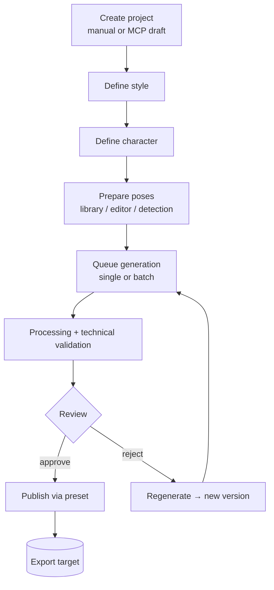
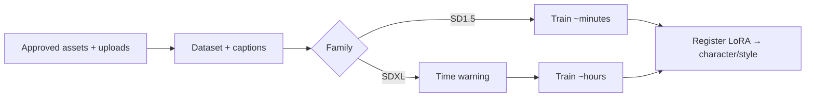

# User Flows (business level)

Screen-level flows are designed in Phase 3 ([[Design-Overview]]).

## Produce consistent illustrations

```mermaid
flowchart TD
  A[Create project<br/>manual or MCP draft] --> B[Define style]
  B --> C[Define character]
  C --> D[Prepare poses<br/>library / editor / detection]
  D --> E[Queue generation<br/>single or batch]
  E --> F[Processing + technical validation]
  F --> G{Review}
  G -- approve --> H[Publish via preset]
  G -- reject --> I[Regenerate → new version]
  I --> E
  H --> J[(Export target)]
```

## Improve consistency with training

```mermaid
flowchart LR
  A[Approved assets + uploads] --> B[Dataset + captions] --> C{Family}
  C -- SD1.5 --> D[Train ~minutes]
  C -- SDXL --> W[Time warning] --> E[Train ~hours]
  D --> F[Register LoRA → character/style]
  E --> F
```
